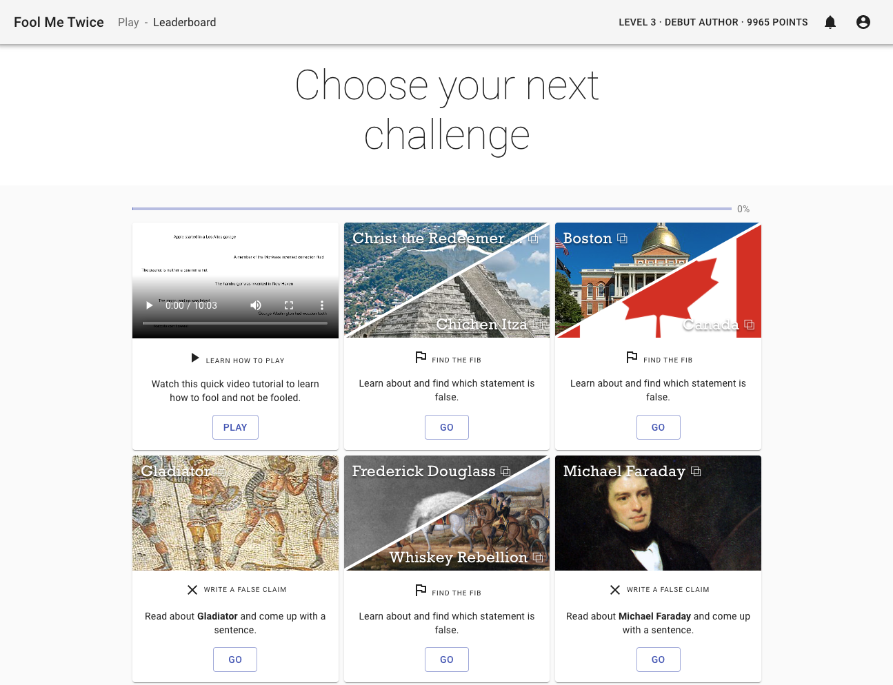
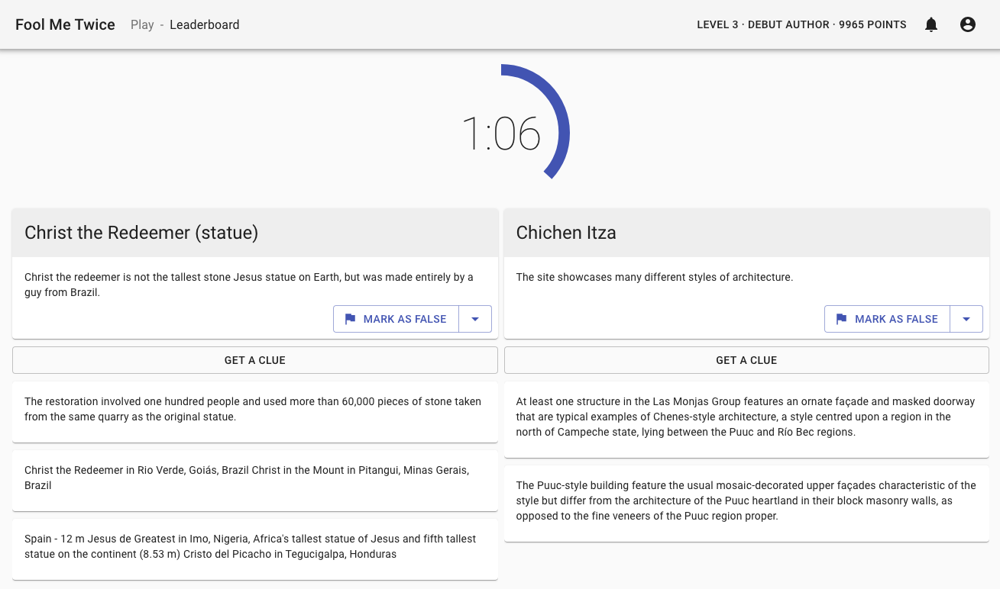

# Fool Me Twice

Code for the game, experiments and data introduced in the paper [Fool Me Twice: Entailment from Wikipedia Gamification](https://arxiv.org/abs/2104.04725) published at NAACL 2021.

In this work we set up a game for players to distinguish entailed from refuted statements by looking at the evidence from their Wikipedia page. Players can also write their own statements and they are rewarded by making them hard to guess but properly backed by the evidence, which they have to choose. We release a dataset of nearly 13K statements with their evidence.

This is how the game looks: the first screen allows users to choose topics of their interest. In the second screen they reveal evidence and make a guess before time runs out.
<p align="center">


</p>

## Download the data

| Split  | Claims | Entailed Proportion | Pages | Avg. # Tokens Claim | Avg. # Tokens Evidence |
|--------|--------|---------------------|-------|---------------------|------------------------|
| [Train](https://github.com/google-research/fool-me-twice/blob/main/dataset/train.jsonl) | 10,419 | 49.2%               | 1,811 | 15                  | 30                     |
| [Dev](https://github.com/google-research/fool-me-twice/blob/main/dataset/dev.jsonl)   | 1,169  | 51.0%               | 209   | 15                  | 31                     |
| [Test](https://github.com/google-research/fool-me-twice/blob/main/dataset/test.jsonl)  | 1,380  | 49.4%               | 234   | 15                  | 31                     |
| Total  | 12,968 | 49.4%               | 2,254  | 15                  | 30                     |

## Running analysis and training models on the date

1. NLI Baselines [notebook](https://colab.research.google.com/github/google-research/fool-me-twice/blob/master/notebooks/nli_baselines.ipynb) trains BERT entailment models on FM2 and FEVER.

2. The LMI Analysis [notebook](https://colab.research.google.com/github/google-research/fool-me-twice/blob/master/notebooks/lmi_analysis.ipynb) shows the most informative terms in FM2 compared to FEVER.

## Running the game

For the time being we are not publishing the game on the web, but we encourage people
to deploy it, collect and release new data and experiment with different game dynamics.

### Setting-up Firebase

This project does not require a server, and uses Firebase for authentication, database, storage, serverless compute, and optionally hosting. For small volumes we don't think it should incur any significant cost,
but it will require setting up a Pay-As-You billing account. If you are new to Google Cloud, you can use the [$300 credit](https://cloud.google.com/free/docs/gcp-free-tier#free-trial), available at the time of writing. If someone else already set-up firebase you can copy over their config `board/src/config/firebase.json` (from step 3) and skip all the rest of the steps.

1. Go to the [Firebase console](https://console.firebase.google.com/) and create a new project. You can name it in any way you like, and the name will be part of the URL if you choose to host the game through Firebase. If asked, we recommend enabling Google Analytics.

2. Once the project is created, add a **Web App**, which can named "board", and enable hosting. No need to run any of the commands at this point.

3. Click on the **Gear + Project Settings** on the top left. Set up a public-facing name as well a support email for the app. Down below in the App section, if you click on the Config radio button you can see the JSON config for your project. Create a new file in `board/src/config/firebase.json` and paste the content. Because we are using a JSON file, so no comments or no trailing commas and the keys have to be quoted. The content should look like this:
```json
{
    "apiKey": "API_KEY",
    "authDomain": "PROJECT_ID.firebaseapp.com",
    "databaseURL": "https://PROJECT_ID.firebaseio.com",
    "projectId": "PROJECT_ID",
    "storageBucket": "PROJECT_ID.appspot.com",
    "messagingSenderId": "SENDER_ID",
    "appId": "APP_ID",
    "measurementId": "G-MEASUREMENT_ID"
}
```

4. Click on the **Gear + Usage and Billing** in the top left and and then in the "Details & Settings" tab change the plan to Blaze (Pay as you go). We recommend that you set-up a budget alert to make sure nothing unexpected happens.

5. Navigate to the **Authentication Section** and add the sign-in methods allowed for the game. At least one should enabled, for example using a Google account.

6. Navigate to the **Firestore Section** and create a new database. Select test mode and then pick a zone near you.

7. Configure functions and firestore (replace your PROJECT_ID)
```shh
$ npm install -g firebase-tools
$ cd firebase
$ firebase login
$ firebase use PROJECT_ID
$ firebase deploy  # Enable the firestore API if asked
```

8. Install [Google Cloud SDK](https://cloud.google.com/sdk/install) and authenticate
```sh
gcloud init
gcloud auth application-default login
gcloud auth application-default set-quota-project PROJECT_ID
```

9. Populate database with a small number of pages and claims
```sh
cd ..
sudo apt-get install npm
npm install -g lunr
pip install -r requirements.txt
python -m spacy download en_core_web_sm
python util/bootstrap.py
```

### Starting the game locally

```sh
cd board
npm install
npm run local
```

### Developing

The project is integrated with a pre-commit eslint hook, you can check the linter
or fix in place with the `eslint src` command, or running `npm run lint`.

### Deploying the game in a production setting on a server

The following snippet will package the app and serve a production build, if you wish to use
firebase to host as well, you can configure it following the steps [here](https://firebase.google.com/docs/hosting/quickstart)
directly in `board` folder, but any number of hosting alternative will also serve.

```sh
cd board
npm run prestart # Only needs to run once
npm run build
npm run start
```

### Uploading more Wikipedia pages

The `categories` folder contains a list of pages in different categories that
can be changed in any way. The * at the beginning of the page denotes priority
to use it when creating a workflow (see below).

Running `python util/download_wiki.py` will fetch the lazily fetch Wikipedia
pages, index them and upload them to storage for the game to use.

### Creating new Workflows and downloading the data

We use the term Workflow to denote the screen a user sees when logging into the game.
It tracks the progress and shows tasks to write or vote on claims. Any claim that
the player has authored will not be shown.

The workflow is not updated dynamically at the moment; you can run a script
(we suggest daily) to generate new tasks for players. This will allow players to
see new content and get points for as the claims they wrote are voted by other players.

To run the workflow generation, run the script `python util/create_workflow.py`.
This will create a new workflow with the name of today's date (e.g., 2020-12-25).
You then need to change the name of the active workflow in the Firebase remote
config to reflect the current active workflow. This can be done by navigating 
to https://console.firebase.google.com/u/0/project/PROJECT_ID/config and adding a string parameter
`kWorkflowID`. This parameter will override in realtime the `defaultConfig` of [board/src/config/server.js](https://github.com/google-research/fool-me-twice/blob/main/board/src/config/server.js).

To debug, change the name of the workflow to something not actively being used (this is possible with a flag, check options using `python util/create_workflow.py --help`).
The script will also do a local backup of all the claims created so far.
After you run the create workflow script, you can import the resulting `csv` file into a spreadsheets to inspect the data.  Sort by the time created to see the latest claims.

## <a name="how-to-cite-tapas"></a>How to cite FM2?

Please cite Fool Me Twice: Entailment from Wikipedia Gamification published at NAACL 2021
```
@inproceedings{eisenschlos-etal-2021-fool,
    title = "Fool Me Twice: Entailment from {W}ikipedia Gamification",
    author = {Eisenschlos, Julian Martin  and
      Dhingra, Bhuwan  and
      Bulian, Jannis  and
      B{\"o}rschinger, Benjamin  and
      Boyd-Graber, Jordan},
    booktitle = "Proceedings of the 2021 Conference of the North American Chapter of the Association for Computational Linguistics: Human Language Technologies",
    month = jun,
    year = "2021",
    address = "Online",
    publisher = "Association for Computational Linguistics",
    url = "https://www.aclweb.org/anthology/2021.naacl-main.32",
    pages = "352--365",
    abstract = "We release FoolMeTwice (FM2 for short), a large dataset of challenging entailment pairs collected through a fun multi-player game. Gamification encourages adversarial examples, drastically lowering the number of examples that can be solved using {``}shortcuts{''} compared to other popular entailment datasets. Players are presented with two tasks. The first task asks the player to write a plausible claim based on the evidence from a Wikipedia page. The second one shows two plausible claims written by other players, one of which is false, and the goal is to identify it before the time runs out. Players {``}pay{''} to see clues retrieved from the evidence pool: the more evidence the player needs, the harder the claim. Game-play between motivated players leads to diverse strategies for crafting claims, such as temporal inference and diverting to unrelated evidence, and results in higher quality data for the entailment and evidence retrieval tasks. We open source the dataset and the game code.",
}
```

## Disclaimer

This is not an official Google product.

## Contact information

For help or issues, please submit a GitHub issue.
